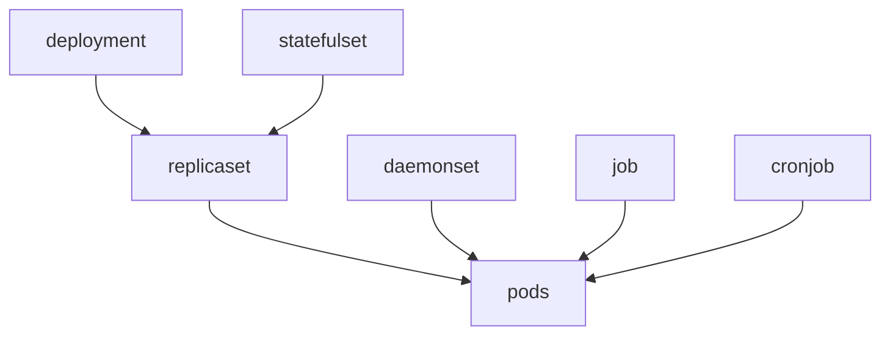
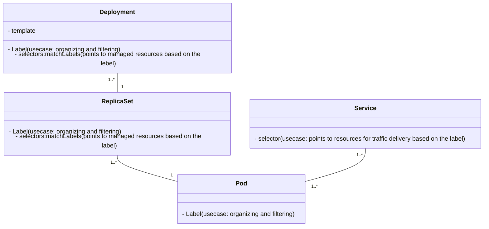

# Kubernetes Annotations and Labels: Comprehensive Guide

**Annotations** and **labels** are metadata attached to Kubernetes objects such as pods, services, and deployments. They help users and tools interact with and manage cluster resources efficiently.

---

## 0. Kubernetes Labels-Selectors - Ambiguity Explained
In Kubernetes, labels are used extensively in various resources like controllers (e.g., `Deployment`, `ReplicaSet`), `Pods`, and more. They appear in fields such as `metadata: labels`, `spec: selector`, `spec: selector: matchLabels`, and `spec: template: metadata: labels`. Here’s how each label type functions:

### Label Types in Kubernetes
- **`metadata: labels`**:
  - Labels under `metadata: labels` are used primarily for `categorization and filtering`. They do not control the resource management for controllers (such as Deployments or StatefulSets).
  - If a resource **is not a controller** or **does not manage other resources**, controllers like Services or Deployments can use selectors `(such as matchLabels)` to target the resource based on these labels.

- **`spec: selector` and `spec: selector: matchLabels`**:
  - Both spec.selector and spec.selector.matchLabels use "AND" logic in Kubernetes, meaning all labels defined must be present for a resource to match.
  - In a Deployment or ReplicaSet, matchLabels helps controllers manage the Pods they create. When used in Services or similar resources, spec.selector targets Pods or resources that match the specified labels.
    - **Example** : If a ReplicaSet has labels app: myAwesomeApp and solution: cmt, and a Deployment is created with matchLabels: {app: myAwesomeApp}, this Deployment will only manage Pods with exactly matching labels. It will not take over any other ReplicaSets unless their Pod labels also match exactly.

- **`spec: template: metadata: labels`**:
  - Labels in spec.template.metadata.labels are applied to Pods created by the controller (e.g., ReplicaSets, Deployments) and are essential for higher-level controllers, such as Services, to target them through spec.selector.
  - spec.template.metadata.labels defines the labels for resources (such as Pods) created by the controller. These labels can be used by a higher-level object (such as a Service or another controller) for selection through matchLabels or similar selectors.
  - Pods inherit these labels unless explicitly overridden at the Pod level.
### Important Note !!
- Kubernetes labels are not "inherited" from controllers. Instead, they are explicitly defined in the resource template (e.g., Deployment spec.template.metadata.labels for Pods).
- If labels are missing from spec.template.metadata.labels, resources like Pods will not have the necessary labels, which could affect targeting by controllers like Services.
- Best Practice: Always define consistent labels in spec.selector.matchLabels (in the controller) and spec.template.metadata.labels (in the template) to ensure that resources are consistently selected and managed by higher-level controllers.





## 1. Overview

### Labels
- **Definition**: Labels are key-value pairs that are used to identify, organize, and select groups of objects.
- **Purpose**: Primarily used for selection and grouping; labels allow querying and filtering resources based on key-value pairs.

### Annotations
- **Definition**: Annotations are also key-value pairs but are designed to store non-identifying, arbitrary metadata.
- **Purpose**: Used for storing descriptive or configuration data, annotations are often consumed by tools and scripts rather than directly influencing object behavior.

---

## 2. Importance and Use Cases

Labels and annotations enhance Kubernetes management, monitoring, and operational efficiency. Below are some key areas where they play significant roles.

---

## Labels

### Importance of Labels

1. **Efficient Management**: Labels help categorize and select resources, simplifying management and organization in large clusters.
2. **Workload Grouping**: They allow workloads to be grouped by application, environment (e.g., `staging` or `production`), or version.
3. **Service Discovery**: Labels help tools like Prometheus identify relevant resources for monitoring.
4. **Scaling and Rollouts**: Labels enable efficient scaling and rolling updates by targeting specific resource subsets.
5. **Affinity and Anti-Affinity Rules**: Labels are used to define rules that control where pods are scheduled in relation to other resources.

### Examples of Labels

1. **Environment-based Labeling**:
   ```yaml
   labels:
     environment: production
   ```
   _Usage_: Distinguishes production pods from staging or testing, ensuring resources in specific environments are identified easily.

2. **Application-based Labeling**:
   ```yaml
   labels:
     app: payment-service
   ```
   _Usage_: Groups all resources (pods, services, deployments) related to a specific application, such as `payment-service`.

3. **Version-based Labeling**:
   ```yaml
   labels:
     version: v1.0.1
   ```
   _Usage_: Allows easy rollouts and rollbacks, as different versions of resources can be labeled and selected.

4. **Team-based Labeling**:
   ```yaml
   labels:
     team: devops
   ```
   _Usage_: Helps allocate and track resources managed by a specific team, e.g., the `devops` team.

5. **Service Discovery Labeling (e.g., for Prometheus)**:
   ```yaml
   labels:
     monitoring: enabled
   ```
   _Usage_: Signals monitoring tools like Prometheus to include resources with `monitoring: enabled` in their metrics collection.

---

## Annotations

### Importance of Annotations

1. **Detailed Metadata Storage**: Annotations can store complex data or notes that don’t affect resource selection but provide context.
2. **Tool and Script Integration**: They allow third-party tools and scripts to attach additional metadata to resources.
3. **Sidecar Management**: Used to configure or provide metadata for sidecars (e.g., logging or monitoring containers attached to the main pod).
4. **Operational History Tracking**: Annotations can record operational metadata such as deployment timestamps, owners, and update notes.
5. **Configuration for Ingress or Load Balancers**: Annotations allow fine-tuning of Ingress or Load Balancer behavior without altering core configurations.

### Examples of Annotations

1. **Ingress Controller Configuration**:
   ```yaml
   annotations:
     nginx.ingress.kubernetes.io/rewrite-target: /
   ```
   _Usage_: Configures how the Ingress controller should rewrite URLs, crucial for HTTP routing.

2. **Deployment History Tracking**:
   ```yaml
   annotations:
     deployment.kubernetes.io/revision: "2"
   ```
   _Usage_: Tracks the revision number of a deployment, useful for rolling updates and rollbacks.

3. **Prometheus Scraping Configuration**:
   ```yaml
   annotations:
     prometheus.io/scrape: "true"
     prometheus.io/port: "9090"
   ```
   _Usage_: Informs Prometheus to scrape metrics from the annotated resource, essential for monitoring.

4. **Sidecar Configuration**:
   ```yaml
   annotations:
     sidecar.istio.io/inject: "false"
   ```
   _Usage_: Disables automatic sidecar injection (e.g., Istio proxy) for specific pods when unnecessary.

5. **Maintenance Notifications**:
   ```yaml
   annotations:
     cluster-maintenance.kubernetes.io/scheduled: "2024-11-10"
   ```
   _Usage_: Stores the scheduled maintenance date, notifying administrators and tools.

---

## Comparison and Summary

| Aspect            | Labels                                                   | Annotations                                           |
|-------------------|----------------------------------------------------------|-------------------------------------------------------|
| **Primary Use**   | Selection, grouping, filtering                           | Metadata storage, integration with tools              |
| **Scope**         | Identifying and grouping resources                       | Adding non-identifying information                    |
| **Usage**         | Key for service discovery, affinity rules, scaling       | Tool configuration, operational metadata              |
| **Queryable**     | Yes, via selectors (`kubectl get pods -l key=value`)     | No, stored only for metadata                          |
| **Max Data**      | Short, meaningful tags                                   | Can store larger and more complex information         |

---

## Use Cases in Real-World Scenarios

- **Management**: Labels organize resources by environment, application, or team, simplifying large-scale Kubernetes management. Annotations provide valuable operational history and configuration notes.
  
- **Monitoring with Prometheus**: Labels enable Prometheus to discover specific resources, and annotations configure scraping for fine-tuned monitoring.

- **Sidecars**: Labels and annotations help configure sidecar injection (e.g., with Istio or logging agents) and ensure sidecars are attached or skipped based on resource requirements.

- **Affinity Rules**: Labels dictate pod placement by defining affinity and anti-affinity rules, controlling which nodes or regions a pod can or cannot run on.

- **Configuration for Ingress**: Annotations add custom configurations to Ingress resources, impacting URL rewrites, TLS settings, and load balancing behaviors.

---

## Conclusion

Kubernetes labels and annotations enhance organization, manageability, and flexibility within a cluster. By separating identifying data (labels) from descriptive metadata (annotations), Kubernetes ensures that resources are easily identifiable and manageable while allowing administrators and tools to store additional operational and configuration metadata.
