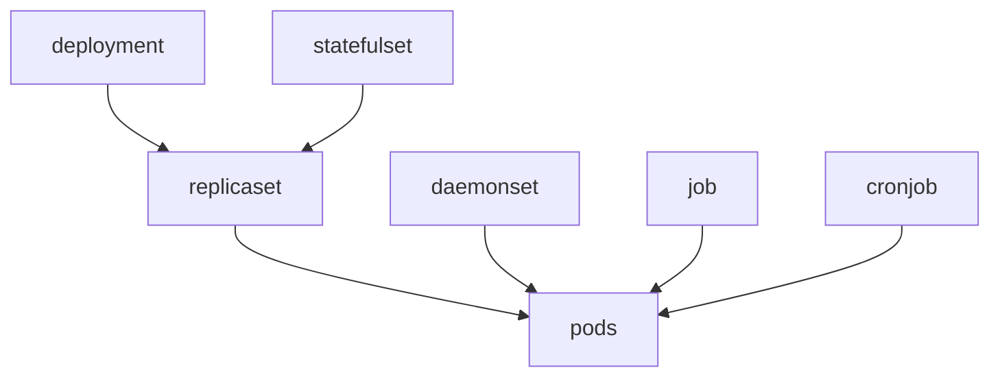
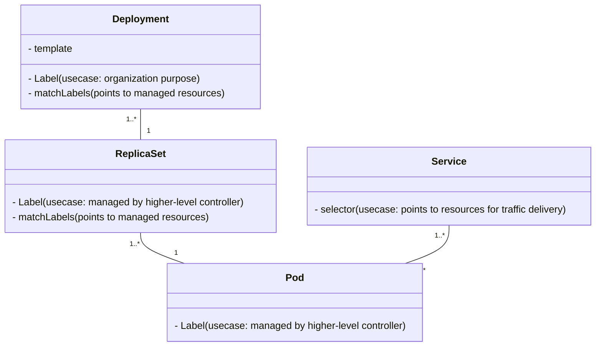

# Kubernetes Labels: Comprehensive Guide for Operations

Labels in Kubernetes are essential for organizing, filtering, and selecting resources. They allow operators to manage large-scale clusters efficiently, enabling various features like grouping, scheduling, service discovery, and integrations with monitoring and logging tools.

## Overview of Labels

Labels are key-value pairs attached to Kubernetes resources, enabling effective resource categorization and selection. Unlike annotations, labels are used directly by Kubernetes components (such as the scheduler or selector-based services) to determine which resources to act upon.

---

## 1. Kubernetes Labels - Ambiguity Explained
In Kubernetes, labels are used extensively in various resources like controllers (e.g., `Deployment`, `ReplicaSet`), `Pods`, and more. They appear in fields such as `metadata: labels`, `spec: selector`, `spec: selector: matchLabels`, and `spec: template: metadata: labels`. Here’s how each label type functions:

### Label Types in Kubernetes
- **`metadata: labels`**:
  - Primarily used for organizing and managing resources. Labels at this level are for **Resource Grouping and Filtering**.
  - This label set **does not control which resources a deployment manages**; it’s meant for categorization and can have any name since it’s not tied to resource selection.
  - If a resource **is not a controller** or **cannot manage other resources**, then higher-level controllers can use its labels to target it using selectors.

- **`spec: selector` and `spec: selector: matchLabels`**:
  - These are essential fields in controllers and must **match the resources that the controller manages**, typically the `spec: template: metadata: labels`.
  - **`spec: selector: matchLabels`** (1-to-many mapping): 
    - Used when you want to manage **multiple resources under a single controller** or for more **advanced management**.
    - **Example**: Suppose you have a standalone `ReplicaSet` and want to create a `Deployment` that also manages this `ReplicaSet` in addition to its own newly created template. `spec: selector: matchLabels` is used here to target multiple sub-resources.
  - **`spec: selector`** (1-to-1 mapping): 
    - Used for direct resource selection, typically when pointing to a single resource template that the controller manages.

- **`spec: template: metadata: labels`**:
  - This is where the labels of a resource template (like a `ReplicaSet`) are defined. A higher-level object in the hierarchy can target this resource by matching these labels.
  - note (that are the same labels the pods will take because of the inheritance feature, unless are overridden In the pod level).
### Important Note !!
- `If` the higher-level controller is `label only defined`, but the `resource created defined in the template` has their **labels not defined** then they will inherit the `controller is label`.
- it's a best practice to define the managed resources labels, for better flexibility and manageability.





## 2. Key Use Cases for Labels

### A. Resource Grouping and Filtering

Labels are fundamental in grouping resources by specific attributes, such as environment, version, or application component. These groupings make it easier to manage resources and apply policies.

#### Example: Grouping Resources by Environment and Application Component

```yaml
apiVersion: apps/v1
kind: Deployment
metadata:
  name: backend-service
  labels:
    app: my-application
    environment: production
    component: backend
```

In this example:
- **app: my-application** groups all resources related to the "my-application" app.
- **environment: production** distinguishes this deployment from staging or development environments.
- **component: backend** helps filter between different components like frontend, backend, or database.

_Usage_: Labeling resources by environment and component enables operators to perform operations (e.g., scaling, monitoring) specific to the production backend only.

---

### B. Service Discovery and Targeting

Labels help expose and select specific groups of resources for services and discovery mechanisms. This is essential for service-based architectures where services must target subsets of resources.

#### Example: Selecting Pods for a Service Based on Labels

```yaml
apiVersion: v1
kind: Service
metadata:
  name: backend-service
spec:
  selector:
    app: my-application
    component: backend
  ports:
    - protocol: TCP
      port: 80
      targetPort: 8080
```

In this setup:
- **selector**: The service targets only pods with both `app: my-application` and `component: backend` labels, filtering traffic specifically to the backend pods.

_Usage_: Service discovery based on labels ensures that only relevant resources receive network traffic.

---

### C. Managing Rolling Updates and Canary Deployments

Labels are crucial for rolling updates and canary deployments, allowing operators to specify which version of an application should be active at any time.

#### Example: Labels for Version-Based Deployments

```yaml
apiVersion: apps/v1
kind: Deployment
metadata:
  name: canary-deployment
  labels:
    app: my-application
    environment: production
    version: v2.0.1
spec:
  selector:
    matchLabels:
      app: my-application
      environment: production
      version: v2.0.1
```

_Usage_: By adding a **version** label, operators can control traffic or manage updates for specific versions of the application (e.g., directing 10% of traffic to `version: v2.0.1`).

---

### D. Scheduling and Node Affinity

Labels are often used to determine which nodes should host specific workloads, enabling efficient utilization and optimization of resources. Node labels, combined with affinity/anti-affinity rules, control the scheduling of resources.

#### Example: Node Affinity for CPU-Intensive Applications

```yaml
apiVersion: v1
kind: Pod
metadata:
  name: high-cpu-pod
  labels:
    app: high-cpu-app
spec:
  affinity:
    nodeAffinity:
      requiredDuringSchedulingIgnoredDuringExecution:
        nodeSelectorTerms:
          - matchExpressions:
              - key: cpu-intensive
                operator: In
                values:
                  - "true"
```

_Usage_: By labeling nodes as **cpu-intensive: true** and specifying affinity, Kubernetes ensures that only nodes labeled for CPU-intensive tasks will run this pod.

---

### E. Monitoring and Metrics Collection with Prometheus

Labels play a significant role in monitoring setups, especially with Prometheus, which uses labels for metric filtering and aggregation.

#### Example: Custom Labels for Prometheus Metrics

Prometheus automatically appends resource labels to metrics, enabling easy filtering and grouping.

```yaml
apiVersion: v1
kind: Pod
metadata:
  name: monitored-app
  labels:
    app: monitored-app
    environment: production
    metrics: enabled
```

_Usage_: In Prometheus, you can filter metrics for production resources with specific labels. Example query:

```
up{app="monitored-app", environment="production", metrics="enabled"}
```

---

### F. Integrations with Third-Party Tools

Labels are essential for configuring third-party tools like Datadog, Elasticsearch, or Istio. These tools can use labels to collect data from specific resources, applying configurations or optimizations selectively.

#### Example: Datadog Integration Using Labels

```yaml
apiVersion: v1
kind: Pod
metadata:
  name: datadog-monitored-app
  labels:
    app: my-app
    monitored-by: datadog
```

In this configuration:
- **monitored-by: datadog** label informs Datadog agents to monitor this pod specifically.

_Usage_: Third-party monitoring tools can target resources more precisely by leveraging labels.

---

### G. Logging and Metric Collection Sidecars

Labels can help control sidecar injection for logging or metrics collection, particularly in environments using service meshes or custom monitoring setups.

#### Example: Label-Based Sidecar Injection

In environments like Istio or OpenTelemetry, labels can trigger automatic sidecar injection for logging or tracing purposes.

```yaml
apiVersion: v1
kind: Pod
metadata:
  name: tracing-enabled-app
  labels:
    app: my-app
    sidecar-injector: enabled
```

_Usage_: Labels simplify managing which pods have sidecars for tracing or metrics, as the sidecar injector automatically detects and adds sidecars based on the label.

---

### H. Custom Application Configurations

Labels allow configurations tailored to specific applications, which can be useful for differentiating environments or enabling feature flags.

#### Example: Custom Configurations by Label

```yaml
apiVersion: apps/v1
kind: Deployment
metadata:
  name: feature-flagged-app
  labels:
    app: my-app
    feature: experimental
```

_Usage_: This setup allows operators to enable or disable experimental features for specific deployments by setting a **feature** label.

---

## Conclusion

Labels are indispensable for efficient Kubernetes management, as they provide robust mechanisms for grouping, filtering, and selecting resources. Through applications in scheduling, service discovery, third-party integrations, and configuration, labels offer a flexible and scalable way to manage complex Kubernetes environments.
